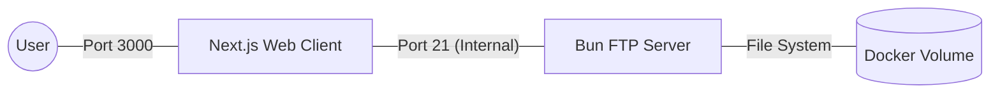

# FTP Client/Server (COE-4330 Design Project)

This project implements a custom FTP Server and a Web-based FTP Client as part
of the Computer Network (COE-4330) course. The system demonstrates the interaction
between a client and server using the File Transfer Protocol logic.

## Team Members
- Francisco Victoriano

## Features
- **File Management:** Upload and delete files via the web UI.
- **Navigation:** List directories and browse file structures.
- **Containerized:** Fully isolated environment using Docker.

## Prerequisites
- [Docker](https://docker.com) (Desktop for Windows/Mac or CLI for Linux)
- [Docker Compose](https://docs.docker.com/compose/)

## How to run
1. **Clone the repository:**
   ```bash
   git clone <your-repo-link>
   cd <project-folder>
   ```
2. **Launch the services:**
   ```bash
   docker compose up -d
   ```
3. **Access the Web Interface:**
   Navigate to [http://localhost:3000](http://localhost:3000).

*Note: Default credentials are provided in the `.env` file (Admin/Admin123 by default).*

## System Architecture

### Diagram


### Tech Stack
- **FTP Server:** 
  - **TypeScript & Bun:** Provides high-performance I/O handling for socket communication.
- **FTP Client:** 
  - **Next.js:** Provides the UI and the API bridge to communicate with the FTP server.
- **Infrastucture:**
  - **Docker Compose:** Handles the virtual network bridge between the two containers.

## Implementation Notes
- **Protocol:** Implements a subset of RFC 959.
- **Networking:** The Client container communicates with the Server container
using the internal Docker DNS name `ftp-server`.
